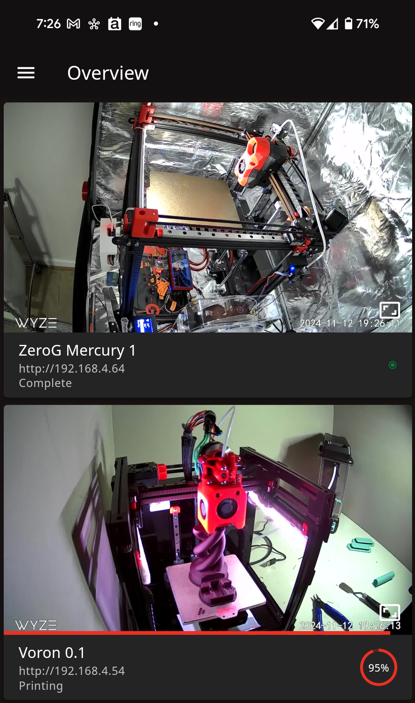

# wyze-mjpeg-proxy

A service providing a MJPEG stream from an RTSP stream.

This was created to take RTSP streams from the [docker-wyze-bridge](https://github.com/mrlt8/docker-wyze-bridge) project and expose them as MJPEG streams so [Mobileraker](https://github.com/Clon1998/mobileraker) can use them:



I created this because `docker-wyze-bridge` is not able to output any streams that work well with `Mobileraker`, and all other options are needlessly complex and/or deprecated like `ffserver`.

This container uses `ffmpeg` to convert the RTSP stream to an MJPEG stream, and then it buffers the last frame in memory, waiting for clients to connect.  Whenn clients ask for a screenshot, it returns the most recent frame instantly (since it already has is). When a client asks for a video stream, it sends the most recent frame and continues sending frames until the client disconnects.  This is very efficient and requires about 300MB of memory for 2 simultaneous 1080p streams.

# Configuration

The MJPEG proxy is uses a config file for all configuration.  You can see the config.example.yaml for inspiration:

```
verbosity: 0
port: 8190
streams:
  - name: mercury-1
    source: rtsp://192.168.4.66:8554/mercury-1-camera
    resolution: 1920x1080
    quality: 80
    framerate: 5
  - name: voron-0
    source: rtsp://192.168.4.66:8554/voron-0-cam
    resolution: 1920x1080
    quality: 80
    framerate: 5
```

In this example, there are two 3D printers being monitored, a ZeroG Mercury One and a Voron 0.

[docker-wyze-bridge](https://github.com/mrlt8/docker-wyze-bridge) is running on `192.168.4.66` and
exposes an RTSP stream at port `8554`.  You can get the `source` URL from the docker-wyze-bridge
GUI like this:


Here is the complete list of options:
- `verbosity`: `0`: off, `1`: verbose, `2`: very verbose
- `port`: the HTTP port to list on for MJPEG image and video requests
- `stream`: a list of video streams to proxy
    - `name`: a name for the stream, this is used as the subdirectory in the URL (see below)
    - `source`: URL for the source RTSP video
    - `resolution`: the output resolution for the video (the video will be scaled down if required)
    - `quality`: The quality of the output video on a scale from `1` (lowest quality) to `100` (highest quality)
    - `framerate`: The output framerate.  Clients will be forced to adhere to this framerate to keep CPU usage down.

# Output
The video an images are available on the host with a URL like this:

```
# Video
http://<host_ip>:<port>/<name>/stream.mjpg

# Snapshot Image
http://<host_ip>:<port>/<name>/image.jpg
```

# Fluidd / Mainsail / Mobileraker Configuration
For Mobileraker to pick up on these video streams, they must be configured in Fluidd or Mainsail first.  Use the URLs above and configure your GUI like this:


Now, in Mobileraker, you can select this camera and it will show snapshots and live video in the app.
